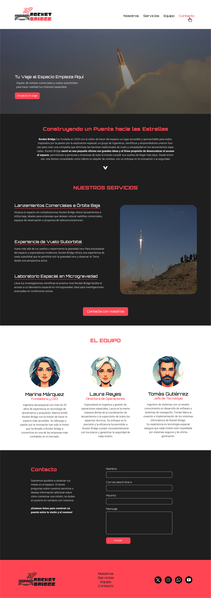
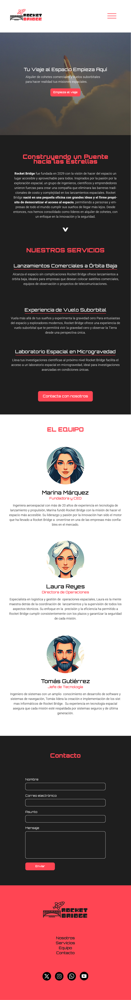

# EJERCICIO 🚀 Landing RocketBridge 🌉

¡Bienvenidos a RocketBridge, vuestra Landing Page para practicar HTML y CSS!

El ejercicio consiste en replicar el diseño de una imagen de referencia `Landing-Rocket.jpg`. Deberás utilizar HTML, CSS y aplicar media queries para adaptar el diseño a diferentes tamaños de pantalla. Esta es la referencia de versión mobile de este diseño: `Landing-Rocket-Mobile.jpg`.

## 🗒️ Instrucciones

1. Crea el archivo `index.html` y una carpeta `/css` con la hoja de estilo dentro `style.css` en VSCode. Recurda vincular el CSS y el HTML. El archivo `index.html` será el punto de inicio para tu proyecto.

2. Crea el código necesario para replicar el diseño de la imagen de referencia proporcionada en la carpeta `assets`. Asegúrate de que el diseño sea fiel a la imagen, incluyendo la estructura del sitio, los colores y las fuentes.

3. Las imágenes e iconos necesarios los encontrarás en la carpeta `img`.
    - Usa la imagen `cursor.png` para que cambie el icono del cursor por el del cohete cuando pases sobre un enlace.

4. Las Fuentes usadas las podéis encontrar en GoogleFonts. Son las siguientes: 

    - Orbitron
    - Roboto

4. Encontraréis instrucciones sobre colores y estilos extra en esta imagen 👉🏼 `instrucciones-extra.jpg` en la carpeta de `assets`. 

5. Asegúrate de que el diseño sea responsive 👉🏼 ver en `assets` la versión mobile `Landing-Rocket-Mobile.jpg`


6. Cuando hayas completado el ejercicio, haz un `add .`, un `commit` y un `push` de tus cambios al repositorio.
   ```
   git add .
   git commit -m "mensaje"
   git push
   ```


## 📷 Imagen de Referencia

A continuación, puedes ver la imagen de referencia que debes replicar en tu diseño:



## Imagen de Referencia Versión Mobile

A continuación, puedes ver la imagen de referencia que debes replicar en tu diseño responsive:



## 📌 Recursos Adicionales

Puedes consultar la documentación de HTML y CSS para obtener ayuda adicional:

- [HTML MDN Web Docs](https://developer.mozilla.org/en-US/docs/Web/HTML)
- [CSS MDN Web Docs](https://developer.mozilla.org/en-US/docs/Web/CSS)